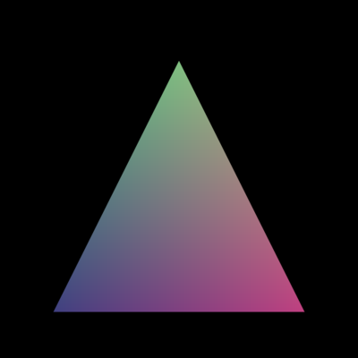
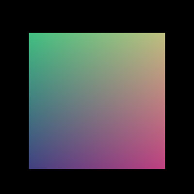
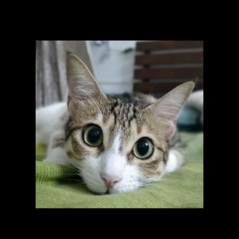

# glwrapper
A small library containing wrappers around OpenGL objects. Functionality is added on an as-needed basis.
DSA is used wherever applicable.

This project is purely for learning purposes.

## Examples

`triangle`:\

`square`:\

`texture2D`:\
